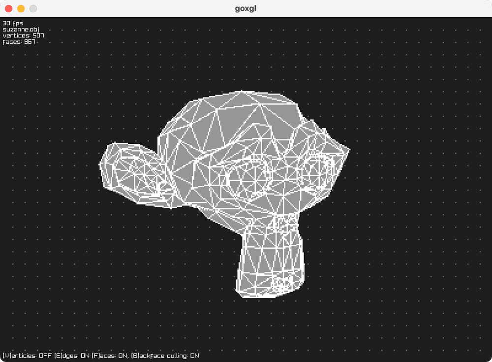

# goxgl

A purely software (no OpenGL or DirectX) 3D rasterizer, that I’m trying to build 
to learn something about 3D graphics. It uses raylib for window management and 
delivering pixels to the screen, but all the rendering is done from scratch in 
Go with no external libraries.



## Building

For this, you may need a C compiler and additional dependencies required by 
raylib. See https://github.com/gen2brain/raylib-go#requirements for details.

```
$ make build
```

## Running

```
$ ./goxgl models/suzanne.obj
```

## Features

 * [x] Wireframe rendering
 * [x] OBJ file loading
 * [x] Backface culling
 * [x] Transformations
 * [ ] Texture mapping
 * [ ] Shading
 * [ ] Z-buffering
 * [ ] View frustum clipping

## Resources

 * [Scratchapixel](https://www.scratchapixel.com) 
 * [tinyrenderer](https://github.com/ssloy/tinyrenderer)
 * [Math for Game Developers](https://www.youtube.com/playlist?list=PLW3Zl3wyJwWOpdhYedlD-yCB7WQoHf-My)
 * [OBJ file format](https://people.computing.clemson.edu/~dhouse/courses/405/docs/brief-obj-file-format.html)